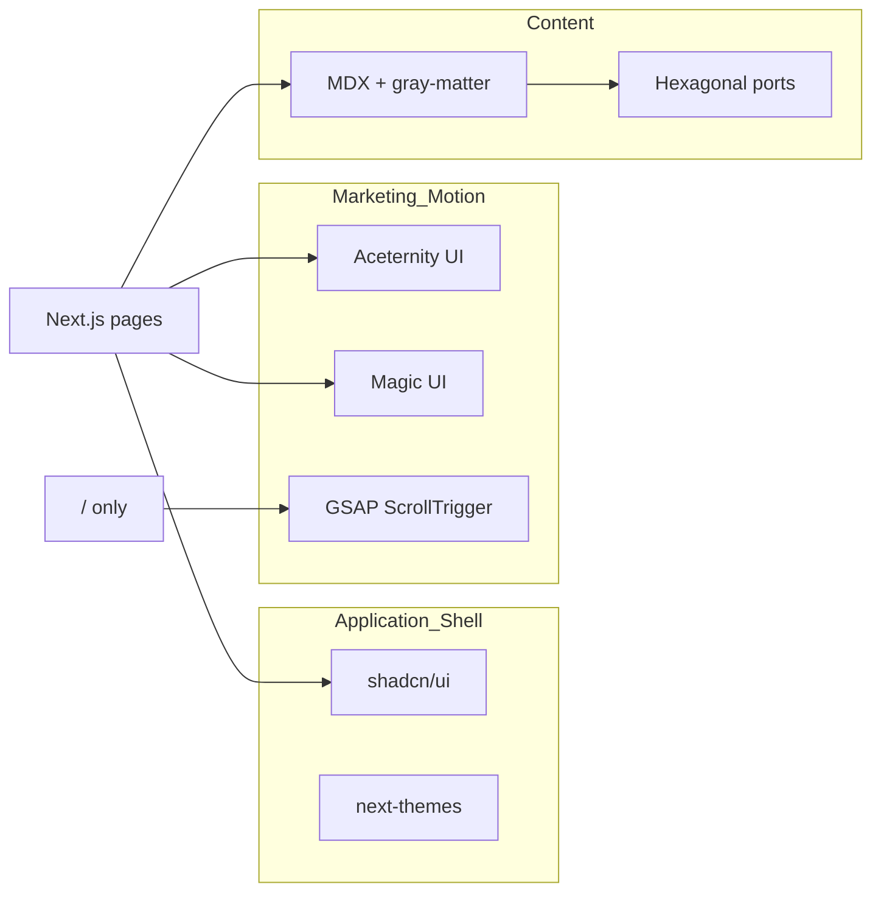
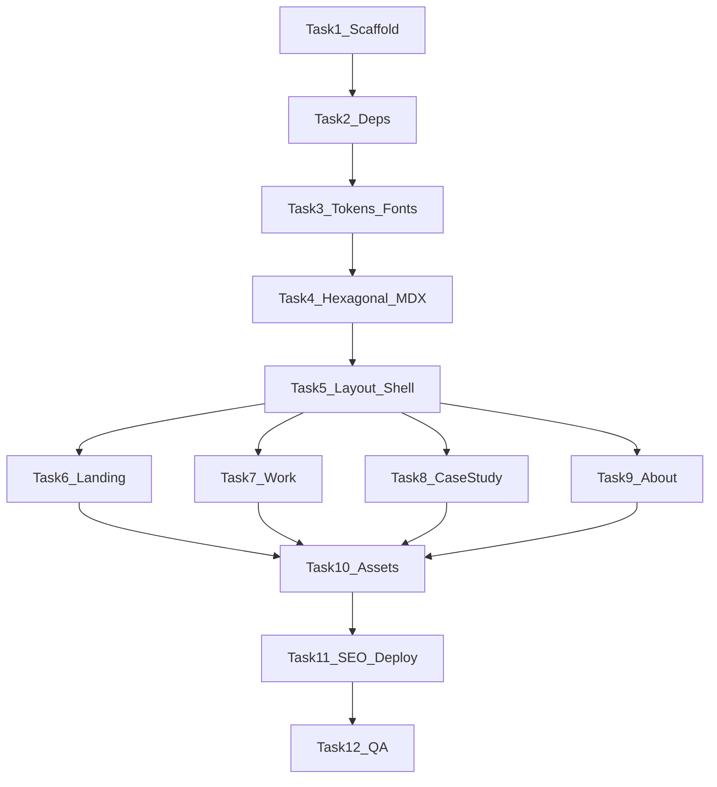

# Surya Portfolio — End-to-End Implementation Plan

> **For agentic workers:** Execute task-by-task. Checkboxes track progress. Do not edit [`.cursor/plans/surya_portfolio_design_65bce244.plan.md`](/Users/kurama/.cursor/plans/surya_portfolio_design_65bce244.plan.md).

**Goal:** Ship a production portfolio at `/Users/kurama/Documents/Projects/Surya-Portfolio` with IP-safe Zoro-inspired aesthetic, cinematic landing, calm case studies, and global Cmd+K — deployable on Vercel.

**Architecture:** Hexagonal content layer (domain → application ports → MDX adapter) behind Next.js App Router pages. shadcn/ui owns shell/accessibility; Aceternity + Magic UI own marketing surfaces; GSAP scoped to `/` only.

**Tech stack:** Next.js 15 (App Router, Turbopack), TypeScript, Tailwind CSS v4, shadcn/ui, motion, GSAP + ScrollTrigger, next-themes, gray-matter + next-mdx-remote, Geist + Clash Display + Fraunces fonts, @material-symbols-svg/react, Lucide.

**Inputs:** Spec at [`docs/superpowers/specs/2026-07-11-surya-portfolio-design.md`](docs/superpowers/specs/2026-07-11-surya-portfolio-design.md) (decisions locked). This plan expands it into executable steps.

---

## 0. What exists today

| Path | State |
|---|---|
| [`docs/superpowers/specs/2026-07-11-surya-portfolio-design.md`](docs/superpowers/specs/2026-07-11-surya-portfolio-design.md) | 31-line spec (decisions + routes) |
| [`docs/superpowers/plans/`](docs/superpowers/plans/) | **Empty** — this plan fills it |
| App code | **None** — greenfield |

---

## 1. Design system — exact tokens and fonts

### 1.1 CSS variables (both themes)

Map into [`src/app/globals.css`](src/app/globals.css) and shadcn `:root` / `.dark`:

**Dark (`Santoryu`, default):**
```css
--bg-page: #0b0d0a;
--bg-surface: #12140f;
--bg-elevated: #181b14;
--accent: #a3e635;
--accent-dim: #4d7c0f;
--text-primary: #f2f2ea;
--text-muted: #8a8d82;
--border: #23261e;
```

**Light (`Claude-cream`):**
```css
--bg-page: #faf9f5;
--bg-surface: #ffffff;
--bg-elevated: #f5f4ee;
--accent: #65a30d;
--accent-dim: #a3e635; /* highlight only, not body text */
--text-primary: #1a1a17;
--text-muted: #6b6b63;
--border: #e5e3d8;
```

**shadcn bridge** (same file):
```css
--background: var(--bg-page);
--foreground: var(--text-primary);
--card: var(--bg-surface);
--primary: var(--accent);
--muted-foreground: var(--text-muted);
--border: var(--border);
```

**Signal-color rule:** `--accent` on buttons, active nav, stat values, focus rings, cursor glow only — never as page fill.

### 1.2 Typography — what, how, where

| Role | Font | Load method | CSS variable | Used in |
|---|---|---|---|---|
| Display / hero | **Clash Display** | `@fontsource-variable/clash-display` or Fontshare CDN in [`src/app/layout.tsx`](src/app/layout.tsx) | `--font-display` | H1, hero headline, section titles |
| Body | **Geist Sans** | `geist` npm + `next/font/local` | `--font-sans` | paragraphs, nav, cards |
| Mono | **Geist Mono** | same package | `--font-mono` | stack pills, code blocks |
| Editorial | **Fraunces** | `next/font/google` | `--font-serif` | pull-quotes on `/` convictions + case studies |

**Layout font wiring** ([`src/app/layout.tsx`](src/app/layout.tsx)):
```tsx
import { GeistSans } from "geist/font/sans";
import { GeistMono } from "geist/font/mono";
import { Fraunces } from "next/font/google";

const fraunces = Fraunces({ subsets: ["latin"], variable: "--font-serif" });
// Clash: import clashDisplay from local woff2 in public/fonts or @fontsource

<body className={`${GeistSans.variable} ${GeistMono.variable} ${fraunces.variable} ${clashDisplay.variable} font-sans antialiased`}>
```

**Type scale** ([`globals.css`](src/app/globals.css)):
```css
--text-display: clamp(2.5rem, 5vw, 6rem);
--text-body: clamp(1rem, 1.1vw, 1.125rem);
--space-section: clamp(4rem, 8vw, 10rem);
```

**Do not use:** Inter as display, Poppins, Montserrat, purple-gradient hero clichés.

### 1.3 Motifs (IP-safe)

| Motif | Implementation | File |
|---|---|---|
| Three-line divider | SVG thick-thin-thick diagonal | [`public/assets/icons/three-line-motif.svg`](public/assets/icons/three-line-motif.svg) |
| One-cut reveal | GSAP `clipPath` wipe on `h2` | [`src/components/marketing/section-reveal.tsx`](src/components/marketing/section-reveal.tsx) |
| Precision cursor | Fixed div + crosshair SVG, `(pointer:fine)` only | [`src/components/layout/precision-cursor.tsx`](src/components/layout/precision-cursor.tsx) |
| Haki glow | `.haki-card:hover { box-shadow: 0 0 24px color-mix(in srgb, var(--accent) 20%, transparent); }` | [`globals.css`](src/app/globals.css) |
| Film grain | Fixed pseudo-element, 4% opacity PNG | [`public/assets/textures/grain.svg`](public/assets/textures/grain.svg) (inline SVG noise) |

---

## 2. Library roles — what each does



| Library | Responsibility | Install |
|---|---|---|
| **shadcn/ui** | Button, Command, Sheet, Avatar, ScrollArea, Separator, DropdownMenu, NavigationMenu | `npx shadcn@latest init` then `add button command sheet avatar scroll-area separator dropdown-menu` |
| **Aceternity UI** | Navbar, bento grid, card hover, spotlight, background beams, hero highlight | Copy from [ui.aceternity.com/components](https://ui.aceternity.com/components) into `src/components/ui/` |
| **Magic UI** | NumberTicker, DotPattern, BorderBeam, Particles (fallback) | Copy from [magicui.design/docs/components](https://magicui.design/docs/components) |
| **GSAP** | Hero pin, one-cut, section wipe, stat trigger | `npm i gsap @gsap/react` |
| **motion** | Aceternity/Magic UI dependency | `npm i motion` |
| **next-themes** | Dark/light toggle | `npm i next-themes` |
| **Lucide** | shadcn icons | bundled with shadcn |
| **Material Symbols** | Tech stack pills | `npm i @material-symbols-svg/react` |
| **MDX** | Case studies | `npm i next-mdx-remote gray-matter` |

**Framer Marketplace:** reference only — rebuild patterns in React ([motion tag browse](https://www.framer.com/community/marketplace/components/tags/motion/)).

**Skiper UI:** free patterns only; Cmd+K UX inspired by [skiper92](https://skiper-ui.com/v1/skiper92), implemented with shadcn Command.

---

## 3. Component pick list — per section with URLs

### Global shell

| UI piece | Source | URL |
|---|---|---|
| Primitives | shadcn | [ui.shadcn.com](https://ui.shadcn.com/) |
| Theme | next-themes + shadcn | [Dark mode Next.js](https://ui.shadcn.com/docs/dark-mode/next) |
| Cmd+K | shadcn Command | [Command](https://ui.shadcn.com/docs/components/radix/command) |
| Navbar desktop | Aceternity Resizable Navbar | [resizable-navbar](https://ui.aceternity.com/components/resizable-navbar) |
| Navbar mobile | shadcn Sheet | [Sheet](https://ui.shadcn.com/docs/components/radix/sheet) |
| Footer | Aceternity blocks | [shadcn-blocks → Footers](https://ui.aceternity.com/shadcn-blocks) |
| Dividers | shadcn Separator + three-line SVG | [Separator](https://ui.shadcn.com/docs/components/radix/separator) |
| UI icons | Lucide | [lucide.dev](https://lucide.dev/) |
| Stack icons | Material Symbols | [fonts.google.com/icons](https://fonts.google.com/icons) |

### Landing `/`

| Section | Component | URL |
|---|---|---|
| Canvas BG | Custom `SiteCanvas` | Plan section 5 |
| Hero beams | Aceternity Background Beams | [background-beams](https://ui.aceternity.com/components/background-beams) |
| Hero headline | Aceternity Hero Highlight | [hero-highlight](https://ui.aceternity.com/components/hero-highlight) |
| Spotlight | Aceternity Spotlight New | [spotlight-new](https://ui.aceternity.com/components/spotlight-new) |
| Hero pin + wipe | Custom GSAP | [ScrollTrigger docs](https://gsap.com/docs/v3/Plugins/ScrollTrigger/) |
| CTAs | shadcn Button | [button](https://ui.shadcn.com/docs/components/radix/button) |
| Stats | Magic UI Number Ticker | [number-ticker](https://magicui.design/docs/components/number-ticker) |
| Dot texture | Magic UI Dot Pattern | [dot-pattern](https://magicui.design/docs/components/dot-pattern) |

### Work `/work`

| Section | Component | URL |
|---|---|---|
| Grid | Aceternity Bento Grid | [bento-grid](https://ui.aceternity.com/components/bento-grid) |
| Hover | Aceternity Card Hover Effect | [card-hover-effect](https://ui.aceternity.com/components/card-hover-effect) |
| Featured tile | Magic UI Border Beam | [border-beam](https://magicui.design/docs/components/border-beam) |

### Case study `/work/[slug]`

| Section | Component | URL |
|---|---|---|
| TOC | shadcn ScrollArea + Intersection Observer | [scroll-area](https://ui.shadcn.com/docs/components/radix/scroll-area) |
| Code | Geist Mono + `<pre>` | — |
| Diagrams | Static SVG in `public/diagrams/` | — |
| Quotes | Fraunces + blockquote | — |
| Motion | **None** (no GSAP scroll-jack) | — |

### About `/about`

| Section | Component | URL |
|---|---|---|
| Avatar | shadcn Avatar | [avatar](https://ui.shadcn.com/docs/components/radix/avatar) |
| Portrait | Real photo + CSS duotone filter | `public/assets/images/profile/` |
| Stack row | Material Symbols + mono pills | — |

---

## 4. Folder structure (final)

```
Surya-Portfolio/
├── docs/superpowers/
│   ├── specs/2026-07-11-surya-portfolio-design.md
│   └── plans/2026-07-11-surya-portfolio-implementation.md  ← write this file
├── public/
│   ├── assets/icons/          # three-line-motif.svg, crosshair.svg
│   ├── assets/textures/       # grain.svg
│   ├── assets/images/profile/ # portrait (placeholder until real photo)
│   ├── assets/images/case-studies/
│   └── diagrams/{infer360,skincare-ai,ispeak-ai}/
├── src/
│   ├── app/
│   │   ├── layout.tsx         # fonts, ThemeProvider, SiteCanvas, CommandMenu, cursor
│   │   ├── globals.css        # tokens + haki + grain
│   │   ├── page.tsx           # landing sections
│   │   ├── work/page.tsx
│   │   ├── work/[slug]/page.tsx
│   │   ├── about/page.tsx
│   │   └── opengraph-image.tsx
│   ├── domain/
│   │   ├── case-study.ts
│   │   └── site-meta.ts
│   ├── application/
│   │   ├── ports/content-repository.ts
│   │   ├── get-work-portfolio.ts
│   │   ├── get-case-study-by-slug.ts
│   │   └── search-site-content.ts
│   ├── adapters/content/
│   │   └── mdx-content-repository.ts
│   ├── components/
│   │   ├── ui/                # shadcn + aceternity + magic copies
│   │   ├── layout/            # header, footer, canvas, cursor, command-menu
│   │   └── marketing/         # hero, stats, work-teaser, section-reveal
│   ├── content/case-studies/
│   │   ├── infer360.mdx
│   │   ├── skincare-ai.mdx
│   │   └── ispeak-ai.mdx
│   └── lib/utils.ts
├── components.json
├── next.config.ts
├── vercel.json
└── package.json
```

---

## 5. Canvas engine spec

**File:** [`src/components/layout/site-canvas.tsx`](src/components/layout/site-canvas.tsx)

- Single `<canvas>` in root layout, `fixed inset-0 -z-10 pointer-events-none`
- 80 nodes desktop / 40 mobile; connect pairs within 120px with `rgba(163,230,53,0.08)` lines
- Mouse parallax: max 12px offset on node positions
- Scroll velocity: on `wheel`, boost drift ×1.8, decay over 300ms
- DPR capped at 2; `document.hidden` pauses rAF
- `prefers-reduced-motion`: render static radial gradient only, no animation

---

## 6. Responsive rules (1080p → 8K)

| Breakpoint | Behavior |
|---|---|
| `<768px` | No hero pin; 1-col bento; 40 canvas nodes; Sheet nav |
| `768–1280px` | 2-col bento; hero pin optional off |
| `1280–2560px` | 3-col bento; full cinematic landing |
| `>2560px` | Content wrapper `max-w-[min(90rem,92vw)]` centered; canvas full-bleed |

Test widths: 375, 768, 1280, 1920, 2560, 3840.

---

## 7. MDX case study contract

**Frontmatter** (all three files):
```yaml
title: Infer360
slug: infer360
summary: Multi-agent clinical inference platform.
role: Lead Engineer
stack: [Next.js, Python, OpenAI, PostgreSQL]
metrics:
  - label: Latency reduction
    value: "85%"
heroImage: /assets/images/case-studies/infer360-hero.svg
diagramPaths:
  - /diagrams/infer360/architecture.svg
publishedAt: 2026-01-15
```

**Body sections (headings for TOC spy):** Overview, Challenges, Architecture, Implementation, Results.

---

## 8. Implementation tasks (ordered)

### Task 1: Scaffold and git

**Files:** project root

- [ ] `npx create-next-app@latest . --typescript --tailwind --eslint --app --src-dir --import-alias "@/*" --turbopack`
- [ ] `git init && git add . && git commit -m "chore: scaffold Next.js app"`
- [ ] Write [`docs/superpowers/plans/2026-07-11-surya-portfolio-implementation.md`](docs/superpowers/plans/2026-07-11-surya-portfolio-implementation.md) (copy of this plan)

### Task 2: Dependencies

```bash
npm i geist next-themes gsap @gsap/react motion gray-matter next-mdx-remote @material-symbols-svg/react
npm i -D @tailwindcss/typography
npx shadcn@latest init -d
npx shadcn@latest add button command dialog sheet avatar scroll-area separator dropdown-menu navigation-menu badge
```

### Task 3: Design tokens + fonts

**Files:** [`src/app/globals.css`](src/app/globals.css), [`src/app/layout.tsx`](src/app/layout.tsx)

- [ ] Add all CSS variables from section 1.1
- [ ] Wire Geist, Fraunces, Clash Display variables
- [ ] Add grain overlay, haki-card class, focus ring using `--accent`
- [ ] Add `ThemeProvider` wrapper ([`src/adapters/theme/theme-provider.tsx`](src/adapters/theme/theme-provider.tsx))

### Task 4: Hexagonal content layer

**Files:** `src/domain/*`, `src/application/*`, `src/adapters/content/mdx-content-repository.ts`

- [ ] Define `CaseStudy`, `Project`, `NavItem` types in domain
- [ ] Define `ContentRepositoryPort` with `getAllProjects()`, `getCaseStudyBySlug()`, `search()`
- [ ] Implement MDX adapter reading `src/content/case-studies/*.mdx`
- [ ] Create three MDX stubs with frontmatter from section 7

### Task 5: Layout shell

**Files:** `src/components/layout/header.tsx`, `footer.tsx`, `site-canvas.tsx`, `precision-cursor.tsx`, `command-menu.tsx`

- [ ] Header: Aceternity resizable navbar + Sheet mobile menu + theme toggle
- [ ] Footer: minimal 3-column (nav, social, copyright)
- [ ] SiteCanvas per section 5
- [ ] CommandMenu: Cmd+K routes to /, /work, /about, case study slugs
- [ ] Precision cursor (desktop only)

### Task 6: Landing page `/`

**Files:** [`src/app/page.tsx`](src/app/page.tsx), `src/components/marketing/*`

- [ ] `HeroSection`: Background Beams + Hero Highlight + GSAP pin (disabled `<768px`) + one-cut headline
- [ ] `StatsStrip`: 3–4 NumberTicker metrics (e.g. 85% latency, 12 agents, 3 products)
- [ ] `WorkTeaser`: 3 card links to case studies with Card Hover Effect
- [ ] `ConvictionsStrip`: Fraunces pull-quote — "AI proposes. Humans confirm."
- [ ] `ContactCta`: shadcn Button → mailto or /about
- [ ] Section wipes between major blocks (GSAP, `<400ms`)

### Task 7: Work page `/work`

**Files:** [`src/app/work/page.tsx`](src/app/work/page.tsx)

- [ ] Aceternity Bento Grid with Infer360 featured (Border Beam)
- [ ] Remaining projects in hover cards linking to `/work/[slug]`

### Task 8: Case study template `/work/[slug]`

**Files:** [`src/app/work/[slug]/page.tsx`](src/app/work/[slug]/page.tsx), `src/components/marketing/case-study-layout.tsx`

- [ ] Two-column: sticky TOC (ScrollArea) + MDX body
- [ ] Intersection Observer sets active TOC item
- [ ] Render diagram SVGs from frontmatter paths
- [ ] No GSAP on this route

### Task 9: About page `/about`

**Files:** [`src/app/about/page.tsx`](src/app/about/page.tsx)

- [ ] Avatar + duotone CSS on placeholder portrait
- [ ] Skills row with Material Symbols + Geist Mono pills
- [ ] Fraunces convictions block

### Task 10: Assets and diagrams

**Files:** `public/assets/*`, `public/diagrams/*`

- [ ] Create SVG placeholders: three-line motif, crosshair, grain, case-study hero art (abstract lime-on-black networks)
- [ ] Create simple architecture SVGs for each project (boxes + arrows, no text dependency)

### Task 11: SEO and deploy prep

**Files:** [`src/app/opengraph-image.tsx`](src/app/opengraph-image.tsx), [`vercel.json`](vercel.json), [`next.config.ts`](next.config.ts)

- [ ] Dynamic OG image (dark bg + lime accent + "Surya Portfolio")
- [ ] `metadata` in layout: title, description, openGraph
- [ ] `vercel.json`: framework default; optional `@vercel/analytics`
- [ ] `npm run build` must pass with zero errors

### Task 12: QA checklist

- [ ] `prefers-reduced-motion`: no pin, no canvas anim, no custom cursor
- [ ] Cmd+K keyboard navigation works
- [ ] Theme toggle persists
- [ ] All routes render at 375 / 1920 / 2560 widths
- [ ] Lighthouse: Performance >85, Accessibility >95 on `/`

---

## 9. npm scripts (expected)

```json
{
  "scripts": {
    "dev": "next dev --turbopack",
    "build": "next build",
    "start": "next start",
    "lint": "next lint"
  }
}
```

---

## 10. Execution order summary



---

## 11. Spec self-review (plan vs spec)

| Spec requirement | Task |
|---|---|
| Navbar: Aceternity + Sheet mobile | Task 5 |
| Free/open Skiper patterns only | Task 5 CommandMenu via shadcn |
| MDX placeholders ×3 | Task 4 |
| Canvas-only hero (no video) | Task 5 SiteCanvas + Task 6 |
| Hexagonal architecture | Task 4 |
| GSAP landing only | Task 6; Task 8 explicitly no GSAP |
| prefers-reduced-motion | Task 5 canvas + Task 12 |
| No One Piece IP | Task 10 abstract SVGs only |

No TBDs remain in scope.

---

## 12. After plan approval

1. Save this document to [`docs/superpowers/plans/2026-07-11-surya-portfolio-implementation.md`](docs/superpowers/plans/2026-07-11-surya-portfolio-implementation.md)
2. Execute Tasks 1–12 sequentially
3. Commit at end of each task group (foundation → pages → polish)

**Execution choice after approval:**
- **Inline:** build all tasks in one agent session
- **Subagent-driven:** one subagent per task with review between
